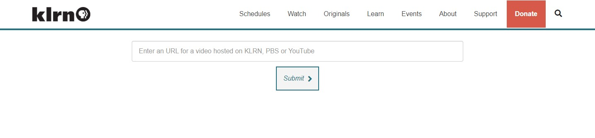

# Get an image from a PBS or YouTube video

This is an application to get images by using URLS for videos hosted on either video.klrn.org, video.pbs.org or youtube.com.

The app does not handle redirects, such as short URLs used by YouTube. Instead, the final destination URL should be used, which in the case of YouTube ends with a "v=" followed by the video ID.



### Setup

**_index.html_** - This file has all the CSS, HTML and JavaScript. Aside from any customizations, the variable at the top of the script file, `const getWebpageAPI`, should be changed to reflect the location of where the api page will be.

**_/api/get-webpage.php_** - This returns HTML as a string from PBS video pages, which is parsed by `function getImage(url)` in index.html. On the second line of get-webpage.php, the `$http_allowed_origins` array should be modified to include only origins allowed to make api requests, such as where index.html is hosted.

Example allowed-origins array:

```
$http_allowed_origins = ['https://klrn.bento-live.pbs.org',
                         'https://www.klrn.org',
                         'http://localhost:8000',
                         'test',
                        ];
```

## References

- https://www.klrn.org/get-image/
